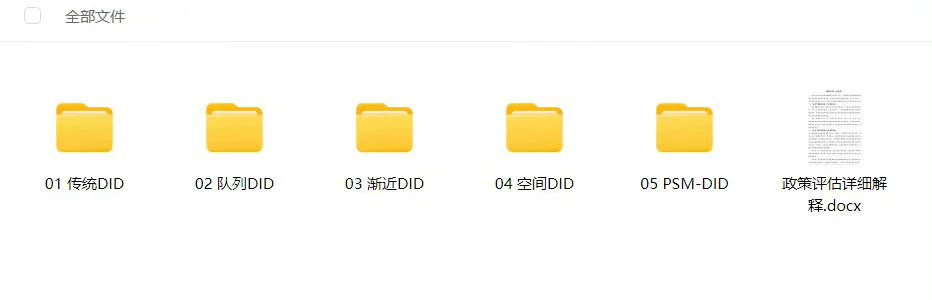
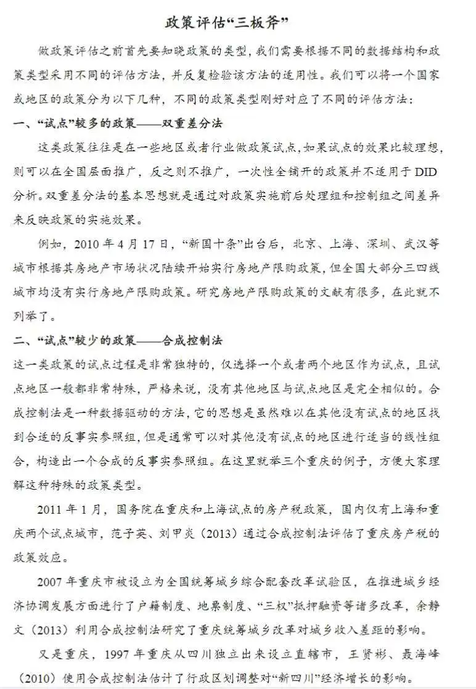
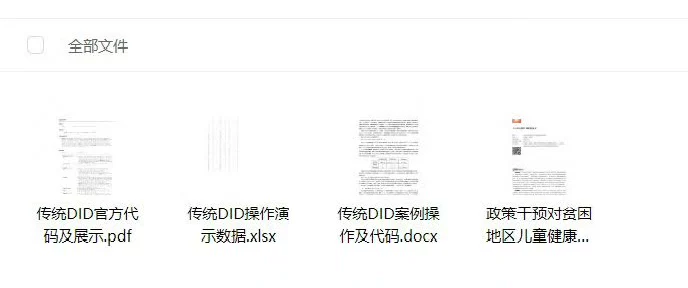
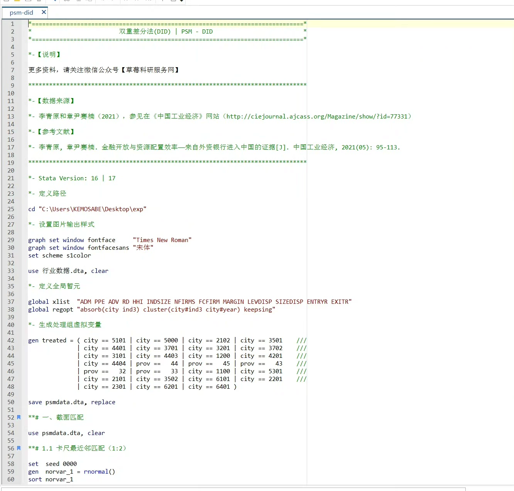

## Body

DID模型案例/DID模型STATA代码合集

（传统DID、队列DID、渐近DID、空间DID、倾向得分匹配-DID）

双重差分（DID）模型是一种应用于经济学、社会学等领域的统计方法，主要用于评估政策或事件的因果效应。以下是DID模型几个重要变体的简要介绍：
1. 传统DID（Traditional DID）：这是DID模型的基础形式，通过比较处理组和控制组在政策实施前后（两个时期）的差异，来估算政策效果。它依赖于所谓的“平行趋势”假设，即在没有处理的情况下，处理组和控制组的变化趋势原本相同。
2. 队列DID（Cohort DID或Panel DID）：当政策在不同时间点逐步实施于不同的小组（队列）时，队列DID模型便派上用场。这种情况下，每个队列有自己的处理前后期，模型可以捕捉到随时间推移，政策效果如何变化。
3. 逐渐接近DID（Gradual DID）：当政策效应不是立即发生而是逐渐显现，或者处理强度随时间变化时，逐渐接近DID模型能够更好地适应这种情况。它允许分析政策影响的动态过程和累积效应。
4. 空间DID（Spatial DID）：在存在空间溢出效应时，即政策在一个地区实施可能会影响到相邻地区，空间DID模型考虑了地理位置因素，用来评估直接影响区域，对周边区域的间接影响。
5. 倾向得分匹配-DID（Propensity Score Matching with DID）：结合倾向得分匹配和DID模型，目的是在处理组和控制组的选择非随机时，提高估计的准确性。通过倾向得分匹配选择与处理组具有相似特征的对照组，然后应用DID方法，可以减少选择偏差，得到更可靠的政策效应估计。

一、数据介绍
数据名称：DID模型案例
样本数量：五种DID案例
数据格式：案例数据
二、指标说明
主要包括传统DID、队列DID、浙近DID、空间DID、倾向得分匹配-DID的相关案例
三、数据文件
传统DID.zip、队列DID.zip、浙近DID.zip、空间DID.zip、倾向得分匹配-DID.zip

## Images

item_1002951895706

Here is a pay link on Stripe ( https://buy.stripe.com/3cs8yP7sY87d0vu9AB ). Please contact me lonlonago@foxmail.com after funding $89, and I will send you a complete data files , thank you!

